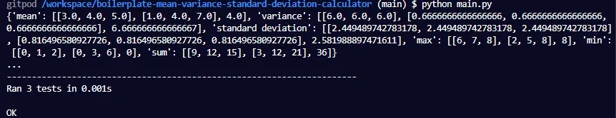
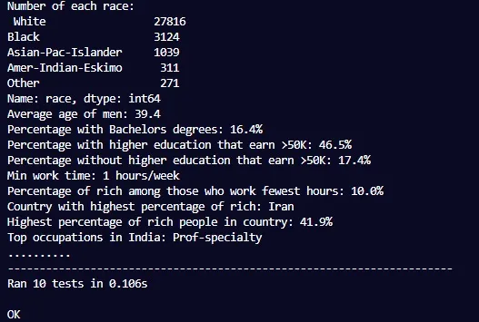
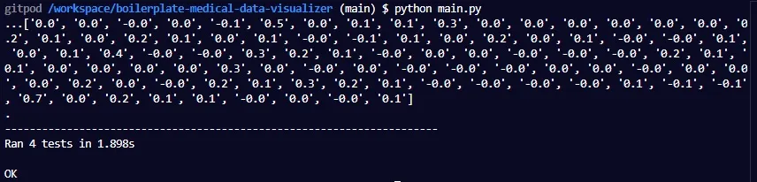
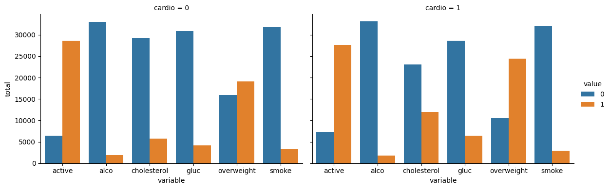
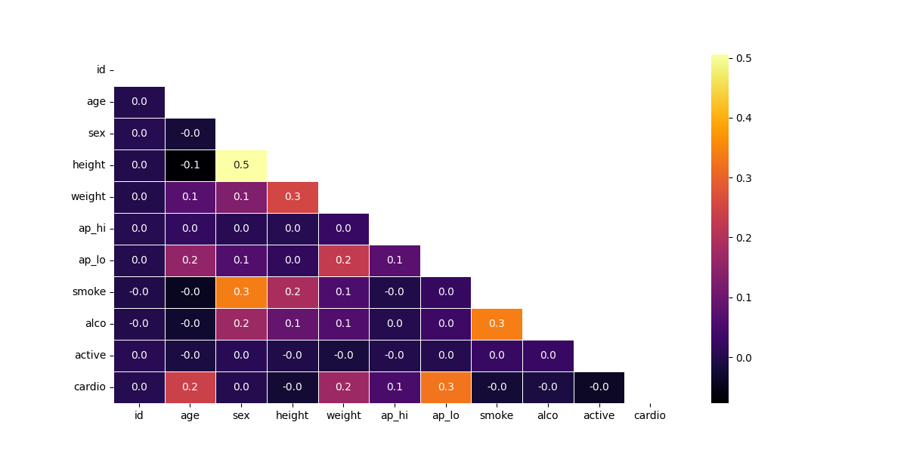
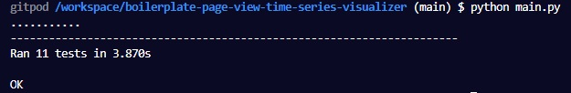
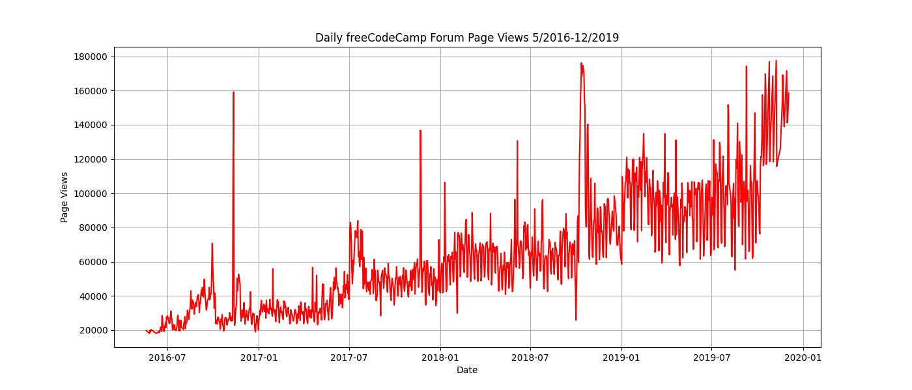
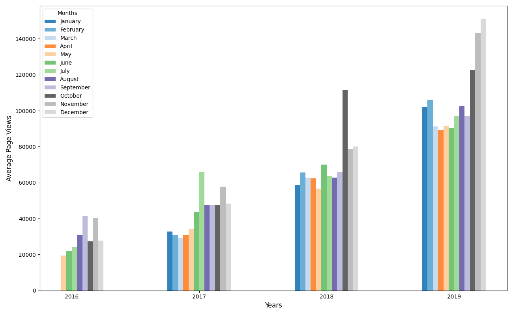
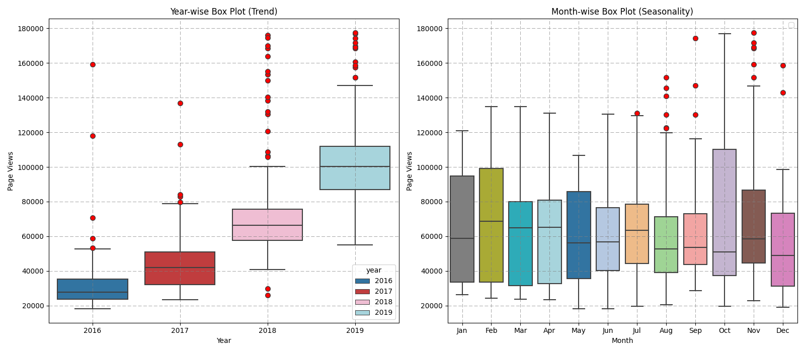
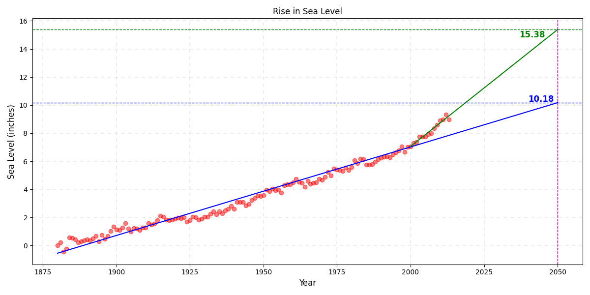

# Data Analysis with Python Projects

Repositorio con el código solución a los 5 proyectos requisitos obligatorios para obtener la [Data Analysis with Python Certification](https://www.freecodecamp.org/learn/data-analysis-with-python/)

## Tabla de Contenidos

- [Data Analysis with Python Projects](#data-analysis-with-python-projects)
  - [Tabla de Contenidos](#tabla-de-contenidos)
  - [Listado de Proyectos](#listado-de-proyectos)
    - [1- Mean-Variance-Standard Deviation Calculator](#1--mean-variance-standard-deviation-calculator)
      - [1.1- Proyecto Aprobado](#11--proyecto-aprobado)
      - [1.2- Todos los tests superados](#12--todos-los-tests-superados)
      - [1.3- Código Creado](#13--código-creado)
    - [2- Demographic Data Analyzer](#2--demographic-data-analyzer)
      - [2.1- Proyecto Aprobado](#21--proyecto-aprobado)
      - [2.2- Todos los tests superados](#22--todos-los-tests-superados)
      - [2.3- Código Creado](#23--código-creado)
    - [3- Medical Data Visualizer](#3--medical-data-visualizer)
      - [3.1- Proyecto Aprobado](#31--proyecto-aprobado)
      - [3.2- Todos los tests superados](#32--todos-los-tests-superados)
      - [3.3- Código Creado](#33--código-creado)
      - [3.4- Gráficos Generados](#34--gráficos-generados)
        - [3.4.1- Gráfico de Columnas](#341--gráfico-de-columnas)
        - [3.4.2- Mapa de Calor](#342--mapa-de-calor)
    - [4- Mean-Variance-Standard Deviation Calculator](#4--mean-variance-standard-deviation-calculator)
      - [4.1- Proyecto Aprobado](#41--proyecto-aprobado)
      - [4.2- Todos los tests superados](#42--todos-los-tests-superados)
      - [4.3- Código Creado](#43--código-creado)
      - [4.4- Gráficos Generados](#44--gráficos-generados)
        - [4.4.1- Gráfico de Líneas](#441--gráfico-de-líneas)
        - [4.4.2- Gráfico de Barras](#442--gráfico-de-barras)
        - [4.4.3- Box Plot](#443--box-plot)
    - [5- Sea Level Predictor](#5--sea-level-predictor)
      - [5.1- Proyecto Aprobado](#51--proyecto-aprobado)
      - [5.2- Todos los tests superados](#52--todos-los-tests-superados)
      - [5.3- Código Creado](#53--código-creado)
      - [5.4- Gráfico Generado: Scatter Plot más Proyecciones](#54--gráfico-generado-scatter-plot-más-proyecciones)

## Listado de Proyectos

### 1- Mean-Variance-Standard Deviation Calculator

#### 1.1- Proyecto Aprobado


#### 1.2- Todos los tests superados



#### 1.3- Código Creado

```py
import numpy as np

def calculate(list):
    n=len(list)
    if n<9:
        raise ValueError("List must contain nine numbers.")

    orig=np.array(list)
    reorg=orig.reshape(3,3)
    mean=[np.mean(reorg,axis=0).tolist(),np.mean(reorg,axis=1).tolist(),np.mean(reorg)]
    variance=[np.var(reorg,axis=0).tolist(),np.var(reorg,axis=1).tolist(),np.var(reorg)]
    std=[np.std(reorg,axis=0).tolist(),np.std(reorg,axis=1).tolist(),np.std(reorg)]
    maxv=[np.max(reorg,axis=0).tolist(),np.max(reorg,axis=1).tolist(),np.max(reorg)]
    minv=[np.min(reorg,axis=0).tolist(),np.min(reorg,axis=1).tolist(),np.min(reorg)]
    sumv=[np.sum(reorg,axis=0).tolist(),np.sum(reorg,axis=1).tolist(),np.sum(reorg)]

    calculations={
        'mean':mean,
        'variance':variance,
        'standard deviation':std,
        'max':maxv,
        'min':minv,
        'sum':sumv
    }

    return calculations
```

### 2- Demographic Data Analyzer

El archivo CSV utilizado llamado **adult.data.csv** NO lo he cargado en mi repositorio por pesar demasiado. Sin embargo, el archivo se encuentra en la siguiente URL: [Link a Archivo](https://github.com/freeCodeCamp/boilerplate-demographic-data-analyzer/blob/main/adult.data.csv)

#### 2.1- Proyecto Aprobado


#### 2.2- Todos los tests superados



#### 2.3- Código Creado

El código que he creado va después de los comentarios. Cada comentario se refiere a lo que se pide realizar.

```py
def calculate_demographic_data(print_data=True):
    # Read data from file
    df = pd.read_csv("adult.data.csv")

    # How many of each race are represented in this dataset? This should be a Pandas series with race names as the index labels.
    race_count = df['race'].value_counts()

    # What is the average age of men?
    average_age_men = round(df[df.sex=='Male'].age.mean(),1)

    # What is the percentage of people who have a Bachelor's degree?
    percentage_bachelors = round(((df.education[df.education=="Bachelors"].count())/(df.education.count()))*100,1)

    # What percentage of people with advanced education (`Bachelors`, `Masters`, or `Doctorate`) make more than 50K?
    # What percentage of people without advanced education make more than 50K?

    # with and without `Bachelors`, `Masters`, or `Doctorate`
    higher_education = df[df.education.isin(['Bachelors', 'Masters', 'Doctorate'])]
    lower_education = df[~df.education.isin(['Bachelors', 'Masters', 'Doctorate'])]

    # percentage with salary >50K
    higher_education_rich = round((higher_education.salary[higher_education.salary=='>50K'].count()/higher_education.salary.count())*100,1)
    lower_education_rich = round((lower_education.salary[lower_education.salary=='>50K'].count()/lower_education.salary.count())*100,1)

    # What is the minimum number of hours a person works per week (hours-per-week feature)?
    min_work_hours = round(df['hours-per-week'].min(),1)

    # What percentage of the people who work the minimum number of hours per week have a salary of >50K?
    num_min_workers = round((df.loc[df['hours-per-week']==df['hours-per-week'].min(),['salary']].value_counts())['>50K'],1)

    rich_percentage = round((df.loc[df['hours-per-week']==df['hours-per-week'].min(),['salary']].value_counts(normalize=True)*100)['>50K'],1)

    # What country has the highest percentage of people that earn >50K?
    highest_earning_country = df.groupby(['native-country', 'salary']).size().unstack(fill_value=0).apply(lambda x: (x / x.sum()) * 100, axis=1)['>50K'].idxmax()
    #otra forma pd.crosstab()
    highest_earning_country_percentage =round(df.groupby(['native-country', 'salary']).size().unstack(fill_value=0).apply(lambda x: (x / x.sum()) * 100, axis=1)['>50K'].max(),1)

    # Identify the most popular occupation for those who earn >50K in India.
    top_IN_occupation = df.loc[(df.salary=='>50K')& (df['native-country']=='India'),['occupation']].mode().iloc[0,0]

    # DO NOT MODIFY BELOW THIS LINE

    if print_data:
        print("Number of each race:\n", race_count)
        print("Average age of men:", average_age_men)
        print(f"Percentage with Bachelors degrees: {percentage_bachelors}%")
        print(f"Percentage with higher education that earn >50K: {higher_education_rich}%")
        print(f"Percentage without higher education that earn >50K: {lower_education_rich}%")
        print(f"Min work time: {min_work_hours} hours/week")
        print(f"Percentage of rich among those who work fewest hours: {rich_percentage}%")
        print("Country with highest percentage of rich:", highest_earning_country)
        print(f"Highest percentage of rich people in country: {highest_earning_country_percentage}%")
        print("Top occupations in India:", top_IN_occupation)

    return {
        'race_count': race_count,
        'average_age_men': average_age_men,
        'percentage_bachelors': percentage_bachelors,
        'higher_education_rich': higher_education_rich,
        'lower_education_rich': lower_education_rich,
        'min_work_hours': min_work_hours,
        'rich_percentage': rich_percentage,
        'highest_earning_country': highest_earning_country,
        'highest_earning_country_percentage':
        highest_earning_country_percentage,
        'top_IN_occupation': top_IN_occupation
    }
```

### 3- Medical Data Visualizer

El archivo CSV utilizado llamado **medical_examination.csv** NO lo he cargado en mi repositorio por pesar demasiado. Sin embargo, el archivo se encuentra en la siguiente URL: [Link a Archivo](https://github.com/freeCodeCamp/boilerplate-medical-data-visualizer/blob/main/medical_examination.csv)

#### 3.1- Proyecto Aprobado


#### 3.2- Todos los tests superados



#### 3.3- Código Creado

La generación de cortes cambia el tipo de datos a categorico lo que provoca errores en los tests si no se modifica. Para evitar el cambio de tipo de datos he utilizado el método **where**.

```py
# 1
df = pd.read_csv("medical_examination.csv")

# 2
# df['overweight'] = pd.cut(df['weight']/(df['height']/100)**2,bins=[0,25,np.inf],labels=[0,1])
df['overweight']=np.where(df['weight']/(df['height']/100)**2<=25,0,1)

# 3
#df['gluc']=pd.cut(df['gluc'],bins=[0,1,np.inf],labels=[0,1])
#df['cholesterol']=pd.cut(df['cholesterol'],bins=[0,1,np.inf],labels=[0,1])

df['gluc']=np.where(df['gluc'] <= 1, 0, 1)
df['cholesterol']=np.where(df['cholesterol']<=1,0,1)

# 4
def draw_cat_plot():
    # 5
    variables=['active', 'alco', 'cholesterol', 'gluc', 'overweight', 'smoke']
    df_cat = pd.melt(df,id_vars=['cardio'],value_vars=variables)


    # 6
    df_cat = df_cat.groupby(["cardio", "variable", "value"]).size().reset_index().rename(columns={0:'total'})

    # 7

    # 8
    fig = sns.catplot(data=df_cat, x="variable", y="total", hue="value", col="cardio",  kind="bar", height=4, aspect=1.5 ).figure


    # 9
    fig.savefig('catplot.png')
    return fig


# 10
def draw_heat_map():
    f1=(df['ap_lo'] <= df['ap_hi'])
    f2=(df['height'] >= df['height'].quantile(0.025))
    f3=(df['height'] <= df['height'].quantile(0.975))
    f4=(df['weight'] >= df['weight'].quantile(0.025))
    f5=(df['weight'] <= df['weight'].quantile(0.975))

    # 11
    df_heat = df[f1 & f2 & f3 & f4 &f5]

    # 12
    corr = df_heat.corr()

    # 13
    mask=np.triu(np.ones(corr.shape), 0).astype(bool)

    # 14
    fig, ax =plt.subplots(figsize=(12, 6))

    # 15

    sns.heatmap(corr, mask=mask, annot=True, linewidths=0.5, ax=ax,cmap='inferno',fmt=".1f")

    # 16
    fig.savefig('heatmap.png')
    return fig
```

#### 3.4- Gráficos Generados

##### 3.4.1- Gráfico de Columnas



##### 3.4.2- Mapa de Calor



### 4- Mean-Variance-Standard Deviation Calculator

El archivo CSV utilizado llamado **fcc-forum-pageviews.csv** NO lo he cargado en mi repositorio por pesar demasiado. Sin embargo, el archivo se encuentra en la siguiente URL: [Link a Archivo](https://github.com/freeCodeCamp/boilerplate-page-view-time-series-visualizer/blob/main/fcc-forum-pageviews.csv)

#### 4.1- Proyecto Aprobado


#### 4.2- Todos los tests superados



#### 4.3- Código Creado

```py
import matplotlib.pyplot as plt
import pandas as pd
import seaborn as sns
from pandas.plotting import register_matplotlib_converters
import calendar
import numpy as np
register_matplotlib_converters()
np.float = float
# Import data (Make sure to parse dates. Consider setting index column to 'date'.)
df = pd.read_csv("fcc-forum-pageviews.csv",index_col='date',parse_dates=['date'])

# Clean data
f1=df.value>df.value.quantile(0.025)
f2=df.value<df.value.quantile(0.975)
df = df[f1 & f2]


def draw_line_plot():
    # Draw line plot
    fig=plt.figure(figsize=(14, 6))
    plt.plot(df.index,df.value,'r')
    plt.grid(True)
    plt.title('Daily freeCodeCamp Forum Page Views 5/2016-12/2019')
    plt.xlabel('Date')
    plt.ylabel('Page Views')

    # Save image and return fig (don't change this part)
    fig.savefig('line_plot.png')
    return fig

def draw_bar_plot():
    # Copy and modify data for monthly bar plot
    aux = df.resample('M').mean().reset_index()

    aux['year'] = aux['date'].dt.year
    aux['month'] = aux['date'].dt.month

    df_bar=aux.pivot(index='year', columns='month', values='value')
    # Draw bar plot

    fig, ax = plt.subplots(figsize=(13, 8))

    colors = plt.cm.tab20c(np.linspace(0, 1, 12))

    width = 0.5 / len(df_bar.columns)
    x = np.arange(len(df_bar.index))
    month_names = {i: calendar.month_name[i] for i in range(1, 13)}
    for i, month in enumerate(df_bar.columns):
        ax.bar(
            x + i * width,
            df_bar[month],
            width=width,
            label=f'{month_names[month]}',
            color=colors[i]
        )

    ax.legend(title='Months', loc='upper left')
    ax.set_xlabel('Years', fontsize=12)
    ax.set_xticks(x + width * (len(df_bar.columns) - 1) / 2)
    ax.set_xticklabels(df_bar.index, fontsize=10)
    ax.set_ylabel('Average Page Views',fontsize=12)
    plt.tight_layout()

    # Save image and return fig (don't change this part)
    fig.savefig('bar_plot.png')
    return fig

def draw_box_plot():
    # Prepare data for box plots (this part is done!)
    df_box = df.copy()
    df_box.reset_index(inplace=True)
    df_box['year'] = [d.year for d in df_box.date]
    df_box['month'] = [d.strftime('%b') for d in df_box.date]

    # Draw box plots (using Seaborn)

    fig, (ax1, ax2) = plt.subplots(1, 2, figsize=(16, 7))

    cmap = plt.cm.tab20
    colors = list(cmap(np.linspace(0, 1, len(df_box['year'].unique()))))

    flierprops = dict(marker='o', color='black', markersize=7, markerfacecolor='red')

    sns.boxplot(x='year', y='value',data=df_box, ax=ax1)
    ax1.set_title('Year-wise Box Plot (Trend)')
    ax1.set_xlabel('Year')
    ax1.set_ylabel('Page Views')
    ax1.grid(True, color='gray', linestyle='--', linewidth=0.5,dashes=(10, 5))

    colors = list(cmap(np.linspace(0, 1, len(df_box['month'].unique()))))
    months=list(calendar.month_abbr[1:])
    sns.boxplot(data=df_box, x='month', y='value', ax=ax2, order=months, hue='month', palette=colors,flierprops=flierprops)
    ax2.set_title('Month-wise Box Plot (Seasonality)')
    ax2.set_xlabel('Month')
    ax2.set_ylabel('Page Views')
    ax2.grid(True, color='gray', linestyle='--', linewidth=0.5,dashes=(10, 5))

    plt.tight_layout()

    # Save image and return fig (don't change this part)
    fig.savefig('box_plot.png')
    return fig
```

#### 4.4- Gráficos Generados

##### 4.4.1- Gráfico de Líneas



##### 4.4.2- Gráfico de Barras



##### 4.4.3- Box Plot



### 5- Sea Level Predictor

El archivo CSV utilizado llamado **epa-sea-level.csv** NO lo he cargado en mi repositorio por pesar demasiado. Sin embargo, el archivo se encuentra en la siguiente URL: [Link a Archivo](https://github.com/freeCodeCamp/boilerplate-sea-level-predictor/blob/main/epa-sea-level.csv)

#### 5.1- Proyecto Aprobado


#### 5.2- Todos los tests superados


#### 5.3- Código Creado

```py
def draw_plot():
    # Read data from file
    df=pd.read_csv("epa-sea-level.csv")

    # Create scatter plot
    plt.figure(figsize=(12, 6))
    plt.scatter(df['Year'], df['CSIRO Adjusted Sea Level'], alpha=0.5,c='r')

    # Create first line of best fit
    res = linregress(df['Year'], df['CSIRO Adjusted Sea Level'])
    years_extended=np.arange(df['Year'].min(), 2051)
    plt.plot(years_extended, res.intercept + res.slope*years_extended, 'b', label='fitted line')

    # Create second line of best fit
    years_from_2000=np.arange(2000, 2051)
    df_2000=df[df.Year>=2000]
    res_2000=linregress(df_2000.Year, df_2000['CSIRO Adjusted Sea Level'])
    plt.plot(years_from_2000, res_2000.intercept + res_2000.slope*years_from_2000, 'g', label='2000 fitted line')

    # Add labels and title
    plt.grid(True, color='gray', linestyle='--', linewidth=0.2,dashes=(25, 25))
    plt.xlabel('Year', fontsize=12)
    plt.ylabel('Sea Level (inches)',fontsize=12)
    plt.title('Rise in Sea Level')
    plt.tight_layout()

    y_proj_1 = res.intercept + res.slope * 2050
    y_proj_2 = res_2000.intercept + res_2000.slope * 2050
    plt.axvline(x=2050, color='purple', linestyle='--', linewidth=1, label='Projection Year (2050)')
    plt.axhline(y=y_proj_1, color='blue', linestyle='--', linewidth=1)
    plt.axhline(y=y_proj_2, color='green', linestyle='--', linewidth=1)


    plt.text(2040, y_proj_1*1.025, f'{y_proj_1:.2f}', color='blue', va='center', fontsize=12,fontweight='bold')
    plt.text(2037, y_proj_2*0.975, f'{y_proj_2:.2f}', color='green', va='center', fontsize=12,fontweight='bold')


    # Save plot and return data for testing (DO NOT MODIFY)
    plt.savefig('sea_level_plot.png')
    return plt.gca()
```

#### 5.4- Gráfico Generado: Scatter Plot más Proyecciones


